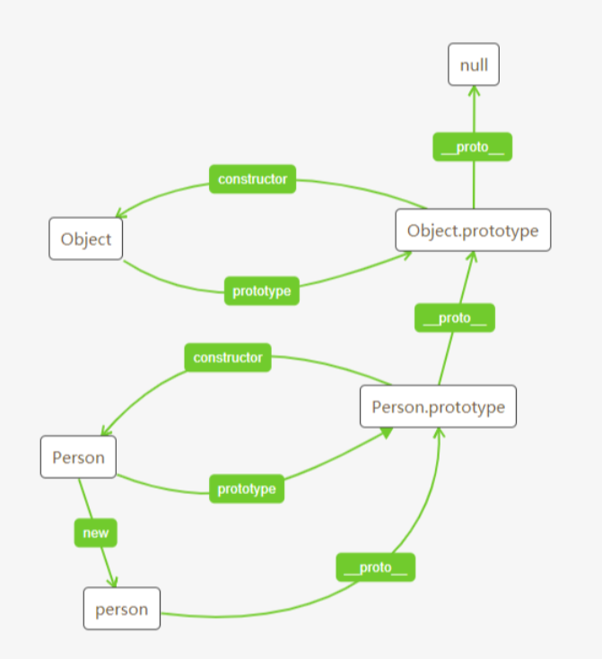

# JS

## 1. js基本数据类型有哪些及它们的区别？

JavaScript共有八种数据类型，分别是 Undefined、Null、Boolean、Number、String、Object、Symbol、BigInt。

其中 Symbol 和 BigInt 是ES6 中新增的数据类型：

- Symbol 代表创建后独一无二且不可变的数据类型，它主要是为了解决可能出现的全局变量冲突的问题。
- BigInt 是一种数字类型的数据，它可以表示任意精度格式的整数，使用 BigInt 可以安全地存储和操作大整数，即使这个数已经超出了 Number 能够表示的安全整数范围。

### 原生数据类型

原始数据类型值在内存中占据**固定大小的空间**，并且它们的操作是按值进行的，即赋值、比较等操作都是直接对值本身进行的

1. **Undefined**：当变量被声明了，但没有被赋值时，它的值就是 `undefined`。
2. **Null**：表示空值，即没有对象值被分配。它用于表示一个空引用（即没有指向任何对象）。虽然 `null` 和 `undefined` 相似，但它们是不同的值。
3. **Boolean**：表示逻辑值，只有两个值：`true` 和 `false`。
4. **Number**：表示整数和浮点数。JavaScript 中所有的数字都是 64 位浮点数（遵循 IEEE 754 标准）。
5. **BigInt**：提供了一种表示大于 `2^53 - 1` 的整数的方法。这解决了 JavaScript 中 `Number` 类型无法精确表示大整数的问题。
6. **String**：表示文本数据。JavaScript 中的字符串是不可变的，即一旦字符串被创建，它的值就不能被改变（尽管可以重新赋值）。
7. **Symbol**：表示独一无二的值。`Symbol` 是一种特殊的、不可枚举的原始数据类型，用作对象的唯一属性名。

### 对象数据类型（引用数据类型）

它们不是按值访问的，而是**引用访问**的。这意呀着，当我们**复制一个对象类型的变量**时，实际上我们**复制的是对对象值的引用**，而不是对象本身。JavaScript 中最常见的对象类型有：

1. **Object**：普通对象，可以包含多个属性（每个属性都有一个键和对应的值）。
2. **Array**：数组对象，用于存储多个值的有序集合。数组中的每个值被称为元素，可以通过索引来访问。
3. **Function**：函数对象，包含可以执行的代码。在 JavaScript 中，函数也是对象，因此它们可以拥有属性和方法。

### 区别

- **存储方式**：原始数据类型是存储在**栈（stack）中的简单数据段**，而对象类型值则是存储在**堆（heap）中的对象**，**栈中存储的是对象的引用（即地址）**。
- **赋值与比较**：原始数据类型是按值赋值的，即赋值操作会创建值的副本；而对象类型是按引用赋值的，赋值操作复制的是引用的副本，即两个变量指向同一个对象。在比较时，原始数据类型比较的是值本身，而对象类型比较的是引用（即是否指向同一个对象）。
- **可变与不可变**：原始数据类型（除了 `BigInt` 和 `Symbol` 之外）是不可变的，即一旦创建，它们的值就不能被改变（尽管可以通过重新赋值来“改变”其值）；而对象类型是可变的，即对象的属性可以在创建后被修改。

## 2. 数据类型检测的方式有哪些？

1.  **typeof**    数组，对象，null  都会被判成object，其他正常
2.  **instanceof**  只能判断  引用数据类型
3.  **Object.prototype.toString.call()**   必须使用原型身上的  因为引用数据类型重写了这个方法，如果正常调用，调用的就是重写之后的
    1. function类型返回内容为函数体的字符串
    2. Array类型返回元素组成的字符串
    3. obj转换为字符串类型

```js
console.log(typeof 2);// number
console.log(typeof true); // boolean
console.log(typeof 'str');  // string
console.log(typeof ["111"]); // object
console.log(typeof function () { 111 }); // function
console.log(typeof { a: 1 }); // object
console.log(typeof undefined);  // undefined
console.log(typeof null); // object

```

```js
console.log(2 instanceof Number); // false
console.log(true instanceof Boolean); // false
console.log('str' instanceof String); // false

console.log(["111"] instanceof Array);// true
console.log(function () { 111 } instanceof Function); // true
console.log({ a: 111 } instanceof Object);  // true

Object.prototype.toString.call()

```

```js
let a = Object.prototype.toString;

console.log(a.call(2));
console.log(a.call(true));
console.log(a.call('str'));
console.log(a.call([]));
console.log(a.call(function () { }));
console.log(a.call({}));
console.log(a.call(undefined));
console.log(a.call(null));

[object Number]
[object Boolean]
[object String]
[object Array]
[object Function]
[object Object]
[object Undefined]
[object Null]
```

## 3.判断数组的方式有哪些？

### 1. `instanceof` 运算符

```
let arr = [1, 2, 3];  
console.log(arr instanceof Array); // true
```

### 2. `Array.isArray()` 方法

```
let arr = [1, 2, 3];  
console.log(Array.isArray(arr)); // true
```

### 3. `Object.prototype.toString.call()` 方法

```
let arr = [1, 2, 3];  
console.log(Object.prototype.toString.call(arr) === '[object Array]'); // true
```

## 4.判断对象的方式？判断空对象的方式？

### 判断对象的方式

####  使用Object.prototype.toString.call (  )

```js
function isObject(value) {  
  return Object.prototype.toString.call(value) === '[object Object]';  
}  
```

### 判断空对象的方式

#### 1.使用`Object.keys()`

得到的结果是对象kay的集合，长度等于0肯定肯定就是空了

```js
function isEmptyObject(obj) {  
  return Object.keys(obj).length === 0;  
}  
  
console.log(isEmptyObject({})); // true  
console.log(isEmptyObject({a: 1})); // false
```

#### 2. 使用`JSON.stringify()`（简单但不推荐）

把对象转字符串，然后对比就知道了

```js
function isEmptyObject(obj) {  
  return JSON.stringify(obj) === '{}';  
}  
  
console.log(isEmptyObject({})); // true  
console.log(isEmptyObject({a: 1})); // false
```

## 5. new 操作符的实现原理？

1. 创建一个新的空对象
2. 新建一个空对象，对象的原型为构造函数的 prototype 对象 
3. 将 this 指向新建对象，并执行函数  
4. 判断函数的返回值类型，如果是值类型，返回创建的对象。如果是引用类型，就返回这个引用类型的对象。

```js
function objectFactory(...args) {  
  let constructor = args.shift(); // 使用剩余参数和 shift 获取构造函数  
  
  // 判断参数是否是一个函数  
  if (typeof constructor !== "function") {  
    throw new TypeError("The first argument must be a function"); // 抛出错误而不是打印到控制台  
    console.error("type error");
    return;
  }  
  
  // 新建一个空对象，对象的原型为构造函数的 prototype 对象  
  let newObject = Object.create(constructor.prototype);  
  
  // 将 this 指向新建对象，并执行函数  
  let result = constructor.apply(newObject, args);  
  
  // 判断返回对象  
  let flag = result !== null && (typeof result === "object" || typeof result === "function");  
  
  // 判断返回结果  
  return flag ? result : newObject;  
}  
  
// 使用方法  

 objectFactory(MyClass, arg1, arg2);  


```

## 6. let、const、var的区别？

**（7）指针指向：** let和const都是ES6新增的用于创建变量的语法。 let创建的变量是可以更改指针指向（可以重新赋值）。但const声明的变量是不允许改变指针的指向。

| **区别**           | **var** | **let** | **const** |
| ------------------ | ------- | ------- | --------- |
| 是否有块级作用域   | ×       | ✔️       | ✔️         |
| 是否存在变量提升   | ✔️       | ×       | ×         |
| 是否添加全局属性   | ✔️       | ×       | ×         |
| 能否重复声明变量   | ✔️       | ×       | ×         |
| 是否存在暂时性死区 | ×       | ✔️       | ✔️         |
| 是否必须设置初始值 | ×       | ×       | ✔️         |
| 能否改变指针指向   | ✔️       | ✔️       | ×         |

## 7. for in和for of的区别

1. for in 都可以遍历**数组**和**对象**，会遍历整个原型链  ，遍历的是对象的kay ，数组的下标
2. for of  遍历的是可迭代对象的值，（数组，字符串，Set , Map等），不会遍历原型链，只关注自身  ，遍历的是value

总结来说就是

 for in 遍历对象

```js
for (let key in obj) {
  console.log(key)  //拿到的是属性名  id name age type address
  console.log(obj[key]) // 拿到的是属性值 1 zhangsan 18 student 北京
}

// 如果只想遍历对象自身的属性，可以使用hasOwnProperty方法  
for (let prop in myObject) {  
    if (myObject.hasOwnProperty(prop)) {  
        console.log(prop + ' is own property'); // 只输出 'prop is own property'  
    }  
}
```

for of 遍历数组

```js
for (let value of arr) {
  console.log(value) // 一 二 三
}
```

想要遍历对象就要使用 Object.keys()  Object.entries()  转成可以迭代的数组  就可以了

```js
// 使用Object.keys()获取对象的所有键，并返回一个数组
// 然后使用for...of循环遍历这个数组
console.log(Object.keys(obj)); //[ 'a', 'b', 'c' ]
for (let key of Object.keys(obj)) {
  console.log(key); // 输出键    a b c
  console.log(key, obj[key]); // 输出键和对应的值  a 1 b 2 c 3
}

// 或者使用Object.entries()，它返回一个包含键值对的数组
console.log(Object.entries(obj)); // [ ['a', 1], ['b', 2], ['c', 3] ]
for (let [key, value] of Object.entries(obj)) {
  console.log(key, value); // 直接输出键和值  a 1 b 2 c 3
}
```

## 8.数组的原生方法？ 未写完

### 会修改原数组的方法

1. **`push()`**：在数组的末尾添加一个或多个元素，并返回新的长度。
2. **`pop()`**：删除并返回数组的最后一个元素。
3. **`shift()`**：删除并返回数组的第一个元素。
4. **`unshift()`**：在数组的开头添加一个或多个元素，并返回新的长度。
5. **`splice()`**：通过删除现有元素和/或添加新元素来更改一个数组的内容。
6. **`sort()`**：对数组的元素进行排序，并返回数组。注意，如果数组包含对象，需要提供一个比较函数来正确排序。
7. **`reverse()`**：颠倒数组中元素的顺序，并返回数组。
8. **`fill()`**：用一个固定值填充一个数组中从起始索引到终止索引内的全部元素。不包括终止索引。
9. **`copyWithin()`**：在当前数组内部，将指定位置的成员复制到其他位置（会覆盖原有成员），然后返回当前数组。

push

```js
const arr = [1, 2, 3, 4, 5] 
// push 数组的最后添加一个或者多个元素
 arr.push(6, 7, 8)

 console.log(arr);  //[1, 2, 3, 4, 5, 6，7，8]
```

pop

```js
const arr = [1, 2, 3, 4, 5] 
// pop 删除数组的最后一个元素
arr.pop()
console.log(arr);  //[1, 2, 3, 4]
```

shift

```js
const arr = [1, 2, 3, 4, 5] 
// shift 删除数组的第一个元素
 arr.shift()
 console.log(arr);  //[2, 3, 4, 5 ]
```

unshift

```js
const arr = [1, 2, 3, 4, 5] 
// unshift 在数组的开头添加一个或者多个元素
arr.unshift(1, 2, 3)
console.log(arr);  //[1, 2, 3, 1, 2, 3, 4,5]
```

splice

```js
const arr = [1, 2, 3, 4, 5] 
//splice  移除 替换  添加
//语法 splice(start, deleteCount, item1)

// 移除
 arr.splice(0, 1)
 console.log(arr);  //[ 2, 3, 4, 5]

// 替换
 arr.splice(0, 1, 'a')
 console.log(arr);  //[ a, 2, 3, 4, 5]

// 添加
arr.splice(arr.length, 0, 'b', 'c')
console.log(arr);  //[1, 2, 3, 4, 5, 'b', 'c']
```

sort

```js
// sort  排序   a-b 升序  b-a  降序
const arr = [1, 2, 3, 4, 5] 
arr.sort((a, b) => {
  return b - a
})
console.log(arr);  //[ 5, 4, 3, 2, 1 ]
```

reverse

```js
//反转数组
let arr = [1, 2, 3, 4];  
arr.reverse();  
console.log(arr); // 输出: [4, 3, 2, 1]
```

fill

```js
// fill 填充数据  fill(value, start, end)  包含start  不包含end
arr.fill(0, 1, 3)
console.log(arr);[1, 0, 0, 4, 5]

arr.fill(0, 0, 3)
console.log(arr);[0, 0, 0, 4, 5]
```

copyWithin

```js
let arr = [1, 2, 3, 4, 5];  
arr.copyWithin(0, 3); // 从索引3开始复制，覆盖从索引0开始的位置  
console.log(arr); // 输出: [4, 5, 3, 4, 5]
```

### 不会修改原数组的方法

1. **`slice()`**：返回一个新的数组对象，这一对象是一个由 `begin` 到 `end`（不包括 `end`）选择的数组的一部分浅拷贝。原始数组不会被修改。
2. **`concat()`**：用于合并两个或多个数组。此方法不会改变现有的数组，而是返回一个新数组。
3. **`join()`**：把数组的所有元素放入一个字符串。元素通过指定的分隔符进行分隔。
4. **`toString()`**：返回一个字符串，表示指定的数组及其元素。
5. **`indexOf()`**：返回在数组中可以找到一个给定元素的第一个索引，如果不存在，则返回-1。
6. **`lastIndexOf()`**：返回指定元素（在数组中）在调用该方法的数组中的最后一个索引，如果不存在则返回 -1。
7. **`find()`**：返回数组中满足提供的测试函数的第一个元素的值。否则返回 `undefined`。
8. **`findIndex()`**：返回数组中满足提供的测试函数的第一个元素的索引。否则返回-1。
9. **`map()`**：创建一个新数组，其结果是该数组中的每个元素是调用一次提供的函数后的返回值。 
10. **`filter()`**：创建一个新数组，其包含通过所提供函数实现的测试的所有元素。
11. **`reduce()`** 和 **`reduceRight()`**：对数组中的每个元素执行一个由您提供的reducer函数(升序执行)，将其结果汇总为单个返回值。

slice

```js
const arr = [1, 2, 3, 4, 5]
// slice(start, end)   复制数组 并且是浅拷贝
const arr1 = arr.slice(0, 3)
 console.log(arr1);  //[ 1, 2, 3 ]
const arr2 = arr.slice()
console.log(arr2); //[ 1, 2, 3, 4, 5 ]
```

concat

```js
//合并对象  concat(value0, value1)
const arr = [1, 2, 3, 4, 5]
const arr1 = [2, 3, 4]
const arr3 = arr.concat(arr1)
console.log(arr3);  //[1, 2, 3, 4,5, 2, 3, 4]
```

join

```js
//将数组拼接成字符串
const arr = [1, 2, 3, 4, 5]
let arr2 = arr.join()   //1,2,3,4,5
let arr3 = arr.join("") //12345
let arr4 = arr.join("+")  //1+2+3+4+5
let arr5 = arr.join(" ") //1 2 3 4 5
```

toString

```js
const arr = [1, 2, 3, 4, 5]
// toString()   将数组转换成字符串
const arr2 = arr.toString()  //1,2,3,4,5
```

indexOf

```js
const arr = [1, 2, 3, 4, 5]
// indexOf 查找元素的位置  找到返回对应下标  没有返回-1
const index = arr.indexOf(3)
console.log(index);  //2

const index1 = arr.indexOf(10)
console.log(index1);  //-1
```

lastIndexOf

```

```

## 9.JS事件循环

### 这是逻辑

> 1. **全局执行上下文（Global Execution Context）开始**：当浏览器解析到 `<script>` 标签时，它会创建一个全局执行上下文，这是事件循环的第一个阶段。此时，代码开始执行。
> 2. **执行同步代码**：在执行上下文中，JavaScript 会按照顺序执行所有的同步代码。
> 3. **宏任务（Macro-tasks）和微任务（Micro-tasks）的收集**：
>    - **宏任务**：如 `setTimeout`、`setInterval`、`setImmediate`（Node.js）、`I/O`、`UI rendering` 等，这些任务会被放入到宏任务队列中。
>    - **微任务**：如 `Promise.then`、`MutationObserver`、`process.nextTick`（Node.js）等，这些任务会被放入到微任务队列中。
> 4. **执行完所有同步代码**：一旦所有的同步代码执行完毕，事件循环就会检查微任务队列。
> 5. **执行微任务**：如果微任务队列不为空，事件循环会连续执行队列中的所有微任务，直到队列清空。注意，这个过程中如果遇到新的微任务，它们会被添加到队列的末尾，并在当前执行批次结束后执行。
> 6. **渲染（如果需要）**：在某些情况下（如浏览器环境），在执行完微任务之后，浏览器会进行页面的渲染。
> 7. **检查宏任务队列**：一旦微任务队列清空，并且可能进行了页面渲染，事件循环会检查宏任务队列。如果队列中有任务，它会取出一个宏任务执行，然后重复步骤 2 到 7 的过程。
> 8. **循环继续**：这个过程会一直重复，直到宏任务队列也为空，并且没有更多的微任务产生。

### 宏任务和微任务

> ​	**宏任务**
>
> - **script**：整体代码（一个 `<script>` 标签内或一个立即执行的函数体内的代码）
> - **setTimeout**：设置一个定时器，该定时器在指定的延迟后执行一个函数或指定的一段代码
> - **setInterval**：重复调用函数或执行代码片段，每次调用之间具有固定的延迟
> - **setImmediate**（Node.js环境）：在I/O事件回调之后，setTimeout 和 setInterval 回调之前，将回调添加到宏任务队列
> - **I/O**：输入输出操作，如HTTP请求
> - **UI rendering**：浏览器对DOM的渲染
> - **postMessage**：跨文档消息传递
> - **MessageChannel**：用于两个脚本之间的通信
>
> **微任务**
>
> - **Promise.then()**、**Promise.catch()**、**Promise.finally()**：当Promise被解决（fulfilled）或拒绝（rejected）时，相应的then、catch、finally回调会被添加到微任务队列
> - **MutationObserver**：当DOM树中的元素发生变化时，会触发MutationObserver的回调，这些回调会被添加到微任务队列
> - **process.nextTick()**（Node.js环境）：用于在事件循环的当前迭代“tick”的末尾调用回调。它的优先级高于Promise的回调
> - **async/await**：虽然async/await本身是构建在Promise之上的，但它们的行为也类似于微任务。使用await表达式会暂停async函数的执行，等待Promise解决，并恢复async函数的执行（以微任务的形式）来处理解决的结果
> - **queueMicrotask** 

### 练习题

```js
console.log('aaa');

setTimeout(() => console.log(111), 0); 
queueMicrotask(() => console.log(222)); 

console.log('bbb');

//结果 a b 222 111
```

```js
console.log('aaa');

(async ()=>{
  console.log(111);  
})().then(()=>{
  console.log(222); 
});

console.log('bbb');

// aaa 111  bbb 222
```

```js
console.log('aaa');

(async ()=>{
  console.log(111);
  await console.log(222);
  console.log(333);
})().then(()=>{
  console.log(444);
});

console.log('ddd');

// aaa  111  222  ddd  333 444
```

```js
console.log('aaa');

setTimeout(()=>console.log('t1'), 0);
(async ()=>{
  console.log(111);
  await console.log(222);
  console.log(333);

  setTimeout(()=>console.log('t2'), 0);
})().then(()=>{
  console.log(444);
});

console.log('bbb');

// aaa  111   222  bbb 333 444  t1 t2
```

```js
function test() {
  console.log(1)
  setTimeout(function () { 	// timer1
    console.log(2)
  }, 1000)
}

test();

setTimeout(function () { 		// timer2
  console.log(3)
})

new Promise(function (resolve) {
  console.log(4)
  setTimeout(function () { 	// timer3
    console.log(5)
  }, 100)
  resolve()
}).then(function () {
  setTimeout(function () { 	// timer4
    console.log(6)
  }, 0)
  console.log(7)
})

console.log(8)


//结果   1  4  8  7   3  6  5   2

```

```js
new Promise ((resolve, reject) => {
console.log (1)
new Promise((resolve, reject) => {
console.log(2)
setTimeout(() => {
resolve(3)
console.log(4)
})
}).then(data => {
setTimeout(() => {
console.log(5)
})
console.log(data)
})
setTimeout(() => {
resolve(6)
console.log(7)
})
}).then(data => {
console.log(data)
setTimeout(() => {
console.log(8)
})
console.log(9)
})
```

> ​	看一下这个硬骨头
>
> 1. 先执行外层promise 1 肯定执行了
> 2. 执行内层的promise 2
> 3. 执行内层promise的.then方法
> 4. 外层的promise的.then执行

## 10.数组的遍历方法有哪些？

```js
const arr = [1, 2, 3, 4, 5, 6, 7, 8, 9, 10];
```

### for循环

```js
for (let i = 0; i < arr.length; i++) {
  console.log(arr[i]);
}
```

### forEach

```js
arr.forEach((item, index, a) => {
  console.log(item, index, a);  // 数组项  下标  数组本身
})
```

### for...of

```js
for (let item of arr) {
  console.log(item);
}
```

### map   遍历

```js
const newArr = arr.map((item, index, c) => {
  console.log(item, index, c);  // 数组项  下标  数组本身
  return item;
})
console.log(newArr);
```

### filter   过滤

```
const newArr = arr.filter((item, index, c) => {
  console.log(item, index, c);  // 数组项  下标  数组本身
  return item;
})
console.log(newArr);
```

### some 只要有一个是true，便返回true

```
const flag = arr.some((item, index, c) => {
  // console.log(item, index, c);  // 数组项  下标  数组本身
  return item === 6;
})
console.log(flag);
```

### every    只要有一个是false，便返回false

```js
const flag = arr.every((item, index, c) => {
  console.log(item, index, c);  // 数组项  下标  数组本身
  return item < 10;
})
console.log(flag);
```

### reduce  (主要用于累加值)

```js
let sum = arr.reduce((accumulator, currentValue) => {
  console.log(currentValue);
  return accumulator + currentValue;
}, 0);
console.log(sum);
```

## 12.forEach和map的区别？

- forEach()方法，对数据的操作会改变原数组，该方法没有返回值；
- map()方法不会改变原数组的值，返回一个新数组，新数组中的值为原数组调用函数处理之后的值；

## 13.深拷贝，浅拷贝？

### 什么是深拷贝浅拷贝

1. 浅拷贝，可以理解复制的其实是引用，指向的其实还是同一块内存地址，修改其中一个，另一个也会受到影响
2. 深拷贝，相反了，新对象和原来的对象，完全独立，修改新对象不会影响原对象

### 浅拷贝的实现方法

#### 数组 可以使用 slice  和content  和 拓展运算符（...） 来实现浅拷贝

拓展运算符实现

```js
const arr = [1, 2, "3", { id: 1, text: "4" }]
const arr1 = [...arr]
arr1[3].text = "修改之后的数据"
console.log(arr, arr1);

//打印的数据
//[ 1 , 2, '3', { id: 1, text: '修改之后的数据' } ] [ 1, 2, '3', { id: 1, text: '修改之后的数据' } ]
```

slice实现

```js
const arr = [1, 2, "3", { id: 1, text: "4" }]
const arr1 = arr.slice()
arr1[3].text = "修改之后的数据"
console.log(arr, arr1);

//打印的数据
//[ 1 , 2, '3', { id: 1, text: '修改之后的数据' } ] [ 1, 2, '3', { id: 1, text: '修改之后的数据' } ]
```

content实现

```js
const arr = [1, 2, "3", { id: 1, text: "4" }]
const arr1 = arr.concat()
arr1[3].text = "修改之后的数据"
console.log(arr, arr1);

//打印的数据
//[ 1 , 2, '3', { id: 1, text: '修改之后的数据' } ] [ 1, 2, '3', { id: 1, text: '修改之后的数据' } ]
```

#### 对象   Object.assign() 和拓展运算符  （...）

拓展运算符实现

```js
const obj = { a: 1, b: { c: 2, d: { f: 3 } }, };
const obj1 = { ...obj }
obj1.b.d = "修改后的数据类型";
console.log(obj, obj1);

//打印的数据
//{ a: 1, b: { c: 2, d: '修改后的数据类型11' } } { a: 1, b: { c: 2, d: '修改后的数据类型11' } }
```

Object.assign()实现

```js
const obj = { a: 1, b: { c: 2, d: { f: 3 } }, };
const obj2 = Object.assign({}, obj)
obj2.b.d = "修改后的数据类型";
console.log(obj, obj2);

//打印的数据
//{ a: 1, b: { c: 2, d: '修改后的数据类型11' } } { a: 1, b: { c: 2, d: '修改后的数据类型11' } }
```

### 深拷贝的实现方法

#### 目前js只有一种办法，使用 JSON.stringify（）

1. JSON.parse()将JSON字符串转换为对象

2. Object.assign()将对象转换为JSON字符串

数组

```js
const arr = [1, 2, "3", { id: 1, text: "4" }]
const arr2 = JSON.parse(JSON.stringify(arr))
arr2[3].text = "修改后的数据类型";
console.log(arr, arr2);

 //[ 1, 2, '3', { id: 1, text: '4' } ] [ 1, 2, '3', { id: 1, text: '修改后的数据类型' } ]
```

对象

```js
const obj = { a: 1, b: { c: 2, d: { f: 3 } }, };
const object = JSON.parse(JSON.stringify(obj))
object.b.d = "修改后的数据类型";
console.log(obj, object);


//{ a: 1, b: { c: 2, d: { f: 3 } } } { a: 1, b: { c: 2, d: '修改后的数据类型' } }
```

但是这个有很大的缺点

1. 不支持不函数，undefined，Symbol
   1. `JSON.stringify()` 会忽略对象中的函数属性，只复制可枚举的自有属性。
   2. 它无法处理 `undefined` 值，会将其转换为 `null`。
   3. `Symbol` 类型的键也会被忽略，因为 JSON 格式不支持 `Symbol`
2. 局限性还是太大了

所以一般就使用lodash 的 _.cloneDeep()

## 14.set数据结构？

允许你存储任何类型的唯一值，无论是原始值或者是对象引用

与数组（`Array`）不同，`Set` 中的元素是唯一的，且没有特定的顺序

### 主要特性

1. **唯一性**：`Set` 中的每个元素都必须是唯一的，即没有重复的值。

2. **无序性**：`Set` 中的元素没有特定的顺序。你不能通过索引来访问元素（与数组不同）。

3. **弱引用**：对于对象引用，`Set` 仅存储对象的弱引用。这意味着如果对象在外部没有其他引用，它仍然可以被垃圾回收器回收，即使它仍然被 `Set` 引用。

   > ​	大白话：set的特点  唯一 无序（不能通过数组下标访问）

主要方法

1. **创建**    new Set()
2. **添加**     add()
3. **是否存在**    has()
4. **删除**    delete()
5. **长度**    size
6. **遍历 set数据**     for  of    forEatch
7. **转成数组**      [...xxx]   拓展运算符

```js
// set数据结构
// 唯一性：Set 中的每个元素都必须是唯一的，即没有重复的值。
// 无序性：Set 中的元素没有特定的顺序。你不能通过索引来访问元素（与数组不同）

// 创建一个set
const mySet = new Set([1, 2, 3, 4, 5, 6, 7, 8, 9])

// 添加
mySet.add(1)

// 判断有没有这个元素
console.log(mySet.has(1));  //true或者false

// 查看set
console.log(mySet);

// 查看set的长度
console.log(mySet.size);  //9

// 删除
// mySet.delete(1)

// 遍历
mySet.forEach(item => {
  console.log(item);  //123456789
});

for (let item of mySet) {
  console.log(item);  //123456789
}

// 转换为数组  
let myArray = [...mySet];
console.log(myArray);
```

## 15.遍历方法哪些可以被打断？

比如：   **for循环**   **forEatch**  **while循环**   **do...while循环**   **map和filter**   **for...of循环**：  **for...in循环**：

> 先介绍一下前提
>
> **break**  跳出循环
>
> **continue**  跳出当前循环
>
> 这两个一般都配合if语句一起使用

### for循环（可中断）

```js
const arr = [1, 2, 3, 4, 5, 6, 7, 8, 9, 10]

for (let i = 0; i < arr.length; i++) {
  console.log(arr[i])
  if (arr[i] === 5) {   //如果是5就跳出循环 中断)
    break;
  }
}

for (let i = 0; i < arr.length; i++) {
  if (i % 2 === 0) {   //如果是偶数就跳过  执行下一次的循环
    continue
  }
  console.log(arr[i])
}
```

###  while循环（可中断）

```js
const arr = [1, 2, 3, 4, 5, 6, 7, 8, 9, 10]

let i = 0;  //起始条件

while (i < arr.length) {
  if (arr[i] === 5) {
    break;
  }
  console.log(arr[i]);
  i++
}
```

### do...while循环（可中断）

最少会执行一次

```js
const arr = [1, 2, 3, 4, 5, 6, 7, 8, 9, 10]

let i = 0;  

do {  
    if (array[i] === 3) {  
        console.log('找到3，中断循环');  
        break; // 中断循环  
    }  
    console.log(array[i]);  
    i++;  
} while (i < array.length);  
// 输出: 1, 2, 找到3，中断循环
```

### for...of循环（可中断）  for...in循环（可中断）

```js
const arr = [1, 2, 3, 4, 5, 6, 7, 8, 9, 10]

for (let item of array) {  
    if (item === 3) {  
        console.log('找到3，中断循环');  
        break; // 中断循环  
    }  
    console.log(item);  
}  
// 输出: 1, 2, 找到3，中断循环
```

### forEach（不可直接中断，但可以通过抛出异常等方式模拟）  不推荐

想中断使用上面的就行了，没必要使用这个，太牵强

```js
let array = [1, 2, 3, 4, 5];  
try {  
    array.forEach(item => {  
        if (item === 3) {  
            throw new Error('找到3，中断forEach'); // 抛出异常来模拟中断  
        }  
        console.log(item);  
    });  
} catch (e) {  
    console.log(e.message); // 输出: 找到3，中断forEach  
}  
// 输出: 1, 2, 然后抛出异常
```

### map和filter（不可直接中断，但可以通过条件判断影响结果）

```js
let array = [1, 2, 3, 4, 5];  
// 使用filter来模拟“中断”  
let filteredArray = array.filter((item, index) => {  
    if (item === 3) {  
        console.log('在filter中遇到3，但filter不会中断');  
        // 返回false来排除这个元素，但不代表中断遍历  
        return false;  
    }  
    return true;  
});  
  
// 输出被排除的元素外的所有元素  
console.log(filteredArray); // [1, 2, 4, 5]  
  
// map的例子中，你通常不会“中断”遍历，但可以通过返回特定值来标记  
let mappedArray = array.map(item => {  
    if (item === 3) {  
        console.log('在map中遇到3，map也不会中断');  
        // 返回null或其他标记值  
        return null;  
    }  
    return item;  
});  
  
console.log(mappedArray); // [1, 2, null, 4, 5]
```

## 16,数字的原生方法有哪些？

### Math对象的方法

Math对象提供了一系列数学常数和函数，用于执行复杂的数学运算。这里是一些常用的Math方法：

- `Math.abs(x)`：返回x的绝对值。
- `Math.ceil(x)`：向上取整，返回大于或等于x的最小整数。
- `Math.floor(x)`：向下取整，返回小于或等于x的最大整数。
- `Math.round(x)`：四舍五入。
- `Math.max([x[, y[, ...]]])`：返回一组数中的最大值。
- `Math.min([x[, y[, ...]]])`：返回一组数中的最小值。
- `Math.random()`：生成一个[0, 1)之间的随机数。

#### Math.abs(x)

```js
console.log(Math.abs(-5)); // 输出: 5
```

#### Math.ceil(x)

```js
console.log(Math.ceil(4.2)); // 输出: 5
```

#### Math.floor(x)

```js
console.log(Math.floor(4.7)); // 输出: 4
```

#### Math.round(x)

```js
 console.log(Math.round(4.51)); // 输出: 5
```

#### Math.max([x[, y[, ...]]])

```javascript
console.log(Math.max(1, 3, 2, 6)); // 输出: 6
```

#### Math.min([x[, y[, ...]]])

```js
console.log(Math.min(1, 3, 2, 6)); // 输出: 1
```

#### Math.random()  会是0但绝不可能是1

```js
console.log(Math.random()); // 输出: 0到1之间的一个随机数，例如0.3456789

// 生成一个0到9之间的随机整数
let randomNumber = Math.floor(Math.random() * 10);

//一个函数，随机生成 0到5  5到9的随机书
function generateTwoRandomNumbers() {  
    // 生成0到5之间的随机数（包括0和5）  
    const firstNumber = Math.floor(Math.random() * 6); // 因为Math.random()是[0,1)，所以乘以6后得到[0,6)，再通过Math.floor向下取整得到[0,5]  
  
    // 生成5到9之间的随机数（包括5和9）  
    const secondNumber = Math.floor(Math.random() * 5) + 5; // 因为Math.random()是[0,1)，所以乘以5后得到[0,5)，然后加5变为[5,10)，再通过Math.floor向下取整得到[5,9]  
  
    // 返回一个包含这两个随机数的数组  
    return [firstNumber, secondNumber];  
} 
```

### Number对象的方法

虽然Number对象的方法大多作为静态方法使用（即不通过Number实例调用），但了解它们也很重要：

- `Number.isInteger(value)`：判断给定的值是否是整数。
- `Number.parseFloat(string)`：解析一个字符串参数，并返回一个浮点数。
- `Number.prototype.toFixed(digits)`：返回该数值的字符串表示，不包含小数部分，但有小数点，并固定的小数位数。

请注意，`toFixed()`, `toExponential()`, 和 `toPrecision()` 是Number实例的方法，但通常用于将数值转换为字符串表示形式。

##### Number.isInteger(value) 

```js
console.log(Number.isInteger(5)); // 输出: true  
console.log(Number.isInteger(5.1)); // 输出: false
```

##### Number.parseFloat(string)  如果解析到不是数字的 后面就不要了  

```js
console.log(Number.parseFloat('123.456abc')); // 输出: 123.456
```

##### toFixed(digits)

```js
let num = 123;
console.log(num.toFixed(5)); // 输出: "123.00000"  //会四舍五入  传入几位就会打印几位小数点
```

## 17.讲讲js上下文

在JavaScript中，"上下文"（Context）通常指的是函数执行时的环境，它决定了函数内部如何访问变量和函数，特别是`this`的值。

- **全局上下文**：最外层的代码运行的环境。
  - **定义**：最外层的代码（不在任何函数内的代码）运行在一个全局上下文中。在浏览器环境中，这个全局对象是`window`；在Node.js环境中，这个全局对象是`global`。
  - **特点**：全局变量和函数都是在这个上下文中定义的，且在整个脚本执行期间都是可访问的。

- **函数上下文**：每个函数被调用时都会创建一个新的上下文，包括`this`的值和局部变量。
  - **定义**：每当一个函数被调用时，它都会创建一个新的上下文，这个上下文是函数执行时的环境。
  - **特点**
    - **this值**：函数上下文中的`this`值取决于函数是如何被调用的。它可以指向全局对象（默认绑定）、某个对象（隐式绑定）、通过`call`、`apply`或`bind`方法指定的对象（显式绑定），或者在箭头函数中继承外围函数的`this`值（箭头函数没有自己的`this`，它捕获其所在上下文的`this`值）。
    - **局部变量**：函数内定义的变量只在函数上下文内有效。

- **模块上下文**（ES6+）：每个模块（通过`import`/`export`语句定义的）都有自己的上下文，类似于全局上下文但具有自己的作用域。
  - **定义**：使用ES6的模块系统（`import`/`export`）时，每个模块都有自己的上下文。
  - **特点**：模块上下文类似于全局上下文，但它有自己的作用域，模块中定义的变量和函数不会污染全局作用域。模块之间的通信是通过`export`和`import`语句实现的。

## 18.讲讲作用域？

作用域是变量和函数可访问性的一个抽象概念。它定义了代码块中变量和函数的可见性。JavaScript采用词法作用域（也称为静态作用域），这意味着作用域是由函数声明时所在的位置决定的，而不是函数执行时的位置。

- **全局作用域**：在任何地方都能访问的变量和函数。
- **函数作用域**（注意：这里的函数作用域与函数上下文不同，但它们之间有关联）：在函数内部声明的变量和函数，在函数外部是不可见的。不过，需要注意的是，在ES6之前，JavaScript没有块级作用域（除了`with`语句和`eval`，但这两者都不推荐使用），但在ES6中引入了`let`和`const`，它们提供了块级作用域。
- **块级作用域**（ES6+）：通过`let`和`const`声明的变量具有块级作用域，这意味着它们只在声明它们的块内部可见。

## 19.讲讲this指向？

`this`的指向并不是在编写代码时静态确定的，而是在调用中确定的

### 1. 全局环境中的`this`

在全局执行上下文中（在浏览器中是`window`对象，在Node.js中是`global`对象），`this`指向全局对象。

```javascript
console.log(this === window); // 在浏览器中为true  
console.log(this.document !== undefined); // 在浏览器中为真
```

### 2. 函数调用中的`this`

在普通函数调用中（即不是作为某个对象的方法被调用），`this`指向全局对象（在严格模式下，`this`为`undefined`）。

```javascript
function foo() {  
  console.log(this === window); // 在浏览器中为true，在严格模式下为false  
}  
  
foo();
```

### 3. 方法调用中的`this`

当函数作为某个对象的方法被调用时，`this`指向该对象。

```javascript
const obj = {  
  x: 42,  
  getX: function() {  
    console.log(this.x); // this指向obj  
  }  
};  
  
obj.getX(); // 输出: 42
```

### 4. 构造函数中的`this`

在构造函数中，`this`被绑定到新创建的对象上。

```javascript
function MyConstructor() {  
  this.x = 42;  
}  
  
const myObject = new MyConstructor();  
console.log(myObject.x); // 输出: 42
```

### 5. 使用`call`、`apply`和`bind`改变`this`指向

- `call`方法允许你为一个函数调用设置`this`值，以及分别提供参数（参数的列表）。
- `apply`方法的作用与`call`相同，唯一的区别是`apply`接受一个数组作为参数。
- `bind`方法会创建一个新函数，这个新函数的`this`被指定为`bind`的第一个参数，而其余参数将作为新函数的参数，供调用时使用。

```javascript
function greet() {  
  return "Hello, " + this.name;  
}  
  
const obj = {name: "Alice"};  
  
console.log(greet.call(obj)); // 输出: Hello, Alice  
console.log(greet.apply(obj)); // 输出: Hello, Alice  
const boundGreet = greet.bind(obj);  
console.log(boundGreet()); // 输出: Hello, Alice
```

### 6. 箭头函数中的`this`

箭头函数不绑定自己的`this`，它会捕获其所在上下文中的`this`值，作为自己的`this`值。

```javascript
const obj = {  
  x: 42,  
  getX: () => {  
    console.log(this.x); // 这里的this指向全局对象，而不是obj  
  }  
};  
  
obj.getX(); // 输出可能不是42，取决于全局上下文中是否有x属性  
  
// 正确的做法  
const obj = {  
  x: 42,  
  getX: function() {  
    return () => {  
      console.log(this.x); // 这里的this指向obj  
    };  
  }  
};  
  
obj.getX()(); // 输出: 42
```

理解`this`的指向对于编写有效的JavaScript代码至关重要。希望这些信息能帮助你更好地掌握JavaScript中的`this`。

看一下相关的面试题

```js
// window有一个name属性，默认为空
const obj = {
  name: "yc",
  getName1 () {
    console.log(this.name);
  },
  getName2: function () {
    console.log(this.name);
  },
  getName3: () => {
    console.log(this.name);
  },
  getName4 () {
    return function () {
      console.log(this.name);
    };
  },
  getName5 () {
    return () => {
      console.log(this.name);
    };
  },
};

obj.getName1();
obj.getName2();
obj.getName3();
obj.getName4()();
obj.getName5()();

getName = obj.getName4();
getName();

getName = obj.getName5();
getName();

obj.getName3.bind({ name: "yc" });
obj.getName3();
```

答案

```json
yc
yc
undefined
undefined
yc
undefined
yc
undefined
```

在来一题

```js
function fn () {
  console.log("real", this);
  const f1 = function () {
    console.log("function", this);
  };
  f1();
  const f2 = () => {
    console.log("=>", this);
  };
  f2();
}
fn.call({ a: 100 });

```

```json
// {a: 100}
 // window
  // {a: 100}
```

在来一题

```js
let num = 11;
function fn () {
  this.num = 22;
  console.log(num); 
  let fn2 = () => {
    console.log(this.num); 
  };
  fn2();
}
new fn();
```

```json
11
22
```


## 20.讲讲call、apply`和`bind？

`call`、`apply`和`bind`都是改变`this`指向用的

他们三个有自己的区

> 1. `call`方法允许你为一个函数调用设置`this`值，以及分别提供参数（参数的列表）。
>
> 2. `apply`方法的作用与`call`相同，唯一的区别是`apply`接受一个数组作为参数。
>
> 3. `bind`方法会创建一个新函数，这个新函数的`this`被指定为`bind`的第一个参数，而其余参数将作为新函数的参数，供调用时使用。

### call使用

`call`方法允许你调用一个函数，同时你可以设置函数体内的`this`指向（即函数执行时上下文），并且可以直接传入一个参数列表（不是数组）给这个函数。

**语法**：

```javascript
javascript复制代码

func.call(thisArg, arg1, arg2, ...)
```

- `thisArg`：在`func`函数运行时使用的`this`值。
- `arg1, arg2, ...`：传递给函数的参数。

```js
// ! call   传递参数给函数   传递的是一个一个参数
function greet (greeting, punctuation) {
  console.log(greeting + ', ' + this.name + punctuation);
}

const preson = {
  name: "德华"
}

// 正常调用
greet("男", "yes"); // 男, undefined小黑   因为调用相对于是全局作用域,但是全局变量window中没有name属性
// 改变this指向试试
greet.call(preson, "保密", "不告诉你")  //保密, 德华不告诉你   this指向 preson    可以看到name属性被成功传递
```

### apply使用

`apply` 方法调用一个函数，其具有一个指定的 `this` 值，以及作为一个数组（或类数组对象）提供的参数。

**语法**：

```javascript
func.apply(thisArg, [argsArray])
```

- `thisArg`：在 `func` 函数运行时使用的 `this` 值。
- `argsArray`：一个数组或者类数组对象，其中的数组元素将作为单独的参数传给 `func` 函数。如果该参数的值为 `null` 或 `undefined`，则表示不需要传入任何参数。

```js
// ! apply  传递参数给函数 传递的是数组
function greet (greeting, punctuation) {
  console.log(greeting + ', ' + this.name + punctuation);
}

const preson = {
  name: "德华"
}

// 正常调用
greet("男", "yes"); // 男, undefined小黑   因为调用相对于是全局作用域,但是全局变量window中没有name属性
// 使用apply改变this指向试试
greet.apply(preson, ["保密", "不告诉你"])  //保密, 德华不告诉你   this指向 preson    可以看到name属性被成功传递
```

### bind使用

`bind` 方法创建一个新的函数，在 `bind` 被调用时，这个新函数的 `this` 被指定为 `bind` 的第一个参数，而其余参数将作为新函数的参数，供调用时使用

**语法**：

```javascript
const newFunc = func.bind(thisArg, arg1, arg2, ...)
```

- `thisArg`：当绑定函数被调用时，该参数会作为原函数运行时的 `this`。
- `arg1, arg2, ...`：当绑定函数被调用时，这些参数将置于实参之前传递给被绑定的方法。

```js
// ! bind  改变函数this指向  但是不会立即执行 传递的是一个一个的参数
const preson = {
  name: "德华"
}

// 正常调用
greet("男", "yes"); // 男, undefined小黑   因为调用相对于是全局作用域,但是全局变量window中没有name属性
// 使用bind改变this指向试试
const greet2 = greet.bind(preson, "保密", "不告诉你")  //返回一个新的函数  这个新的函数的this指向preson
greet2()  //保密, 德华不告诉你   this指向 preson    可以看到name属性被成功传递
```

## 21.继承

### 1.原型链继承

````js
function Animal(name) {
    this.name = name;
}

Animal.prototype.speak = function() {
    console.log(this.name + ' makes a noise.');
};

function Dog(name) {
    Animal.call(this, name); // 调用父类构造函数
}

Dog.prototype = Object.create(Animal.prototype); // Dog 继承自 Animal
Dog.prototype.constructor = Dog; // 修正构造函数引用

Dog.prototype.speak = function() {
    console.log(this.name + ' barks.');
};

let d = new Dog('Rover');
d.speak(); // Rover barks.
````

### 2.类继承

```js
class Animal {
    constructor(name) {
        this.name = name;
    }

    speak() {
        console.log(`${this.name} makes a noise.`);
    }
}

class Dog extends Animal {
    constructor(name) {
        super(name); // 调用父类构造函数
    }

    speak() {
        console.log(`${this.name} barks.`);
    }
}

let d = new Dog('Rover');
d.speak(); // Rover barks.
```

## 22.原型原型链

### 1. 什么是原型？

在 JavaScript 中，所有的对象都与另一个对象相关联，这个对象就是所谓的“原型”（Prototype）

每个对象在创建时，都有一个隐藏的属性 `[[Prototype]]`，这个属性可以通过 `__proto__` 访问

构造函数

实例对象

### 原型对象/原型

原型是一个对象，它可以包含其他对象可以继承的属性和方法。

通过

1. --proto--     
2. constructor
3. prototype

### 原型链

用于--proto-- 是任何对象都有的属性，而js万物皆对象，所以会形成一条--proto--连起来的链条

当js查找对象属性的时候，先查找自己身上有没有，如果没有，就会去原型链上查找

### 原型链终点

```js
console.log(Object.prototype.__proto__); // 输出 null
```

