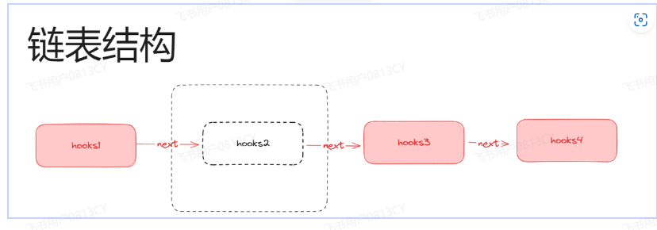
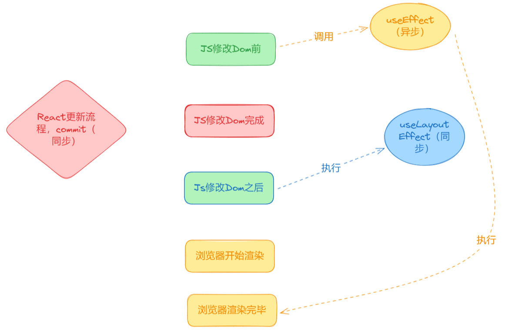
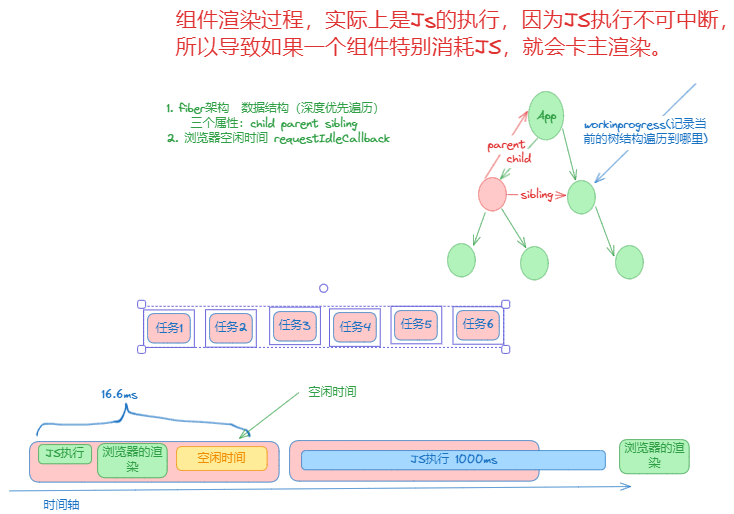
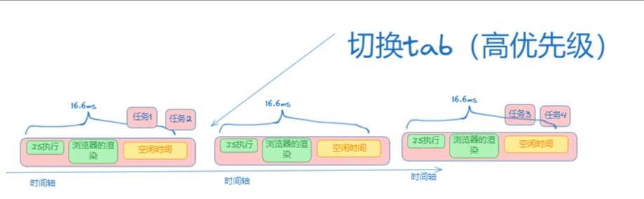

# 介绍

[use – React 中文文档 (docschina.org)](https://react.docschina.org/reference/react/use)

::: tip hooks 注意的事情

不可以写到判断里面



因为组件的 hooks 是用链表这种数据结构来进行连接的，通过 next 属性保持执行顺序。

如果中间的断开，会导致后面的钩子找不到。

:::

## useState

### 样版代码

```tsx
import { useState } from 'react'

function App() {
  const [count, useCount] = useState(0)
  const [name, useName] = useState(() => {
    return '张三'
  })
  const changeCount = () => {
    useCount((count) => {
      console.log(count) // 打印的数据是上一次的数据
      return count + 1
    })
    // ？  这个是多少呢
    // 会发现这个也是上一次的数据，常理来说应该是正常的为什么？
    // 原因：react的组件状态更新是异步的，为了提升性能，react会进行合并
    // 底层：是通过异步的队列，实现的
    console.log(count)
  }

  const changeName = () => {
    useName('李四')
  }
  return (
    <>
      <h1>数字：{count}</h1>
      <h1>名字：{name}</h1>

      <button onClick={changeCount}>修改数字</button>
      <button onClick={changeName}>修改名字</button>
    </>
  )
}

export default App
```

### 解释

::: tip

数组其实是解构出来的

第一个代表我们的状态

第二个代表我们修改数据的方法

:::

## useEffect

### 样版代码

```tsx
import { useEffect } from 'react'

function App() {
  useEffect(() => {
    console.log('useEffect执行了')
  })

  return <>react hooks</>
}

export default App
```

### 执行时机

::: tip

1. 组件初始化

2. 组件更新之后执行（浏览器渲染更新完成之后）

:::

### 参数

::: tip 参数

1. 第一个参数 是`回调函数` ：组件初始化执行 组件更新后执行

2. 第二个参数 是 `数据依赖项` : 是一个数组

   1. 如果第二个参数是空数组 只会执行一次 组件初始化的时候

      ```tsx
      useEffect(() => {
        console.log('useEffect执行了')
      }, [])
      ```

   2. 如果 什么也没有 相当于依赖了全部 组件每次状态更新 就会执行一次

   3. 如果填写了依赖项 依赖项改变一次，就会执行一次

:::

### 返回值

::: tip 返回值

组件卸载执行

```tsx
useEffect(() => {
  console.log('useEffect执行了') //2.在执行
  return () => {
    console.log('useEffect卸载执行了') //1.先返回
  }
})
```

:::

::: tip 返回值执行时机

组件卸载执行

更新（依赖项）也会执行

:::

::: tip 返回值应用场景是什么呢

卸载操作 比如 dom 操作 倒计时操作

:::

### 严格模式 useEffect 初始化会执行两次

::: tip

严格模式 只在开发环境生效

为了避免写出错误的逻辑（副作用），能帮助你尽早发现

和你预期效果不一样

:::

## useLayoutEffect

比 useEffect 先执行



useEffect（异步）是在 commit 的第一个阶段，js 操作 dom 之前调用，但是在浏览器渲染完成之后调用。

useLayoutEffect（同步），JS 操作完 dom 之后调用，在浏览器渲染之前。

## useMemo 性能优化

::: tip

useMemo 用来提升父组件引起子组件不必要渲染的性能优化

:::

比如父子组件

父组件 更新了 子组件肯定也要跟着更新 子组件有一个方法 对性能消耗很大

但是我子组件没有必要更新，因为子组件的状态并没有改变，不需要要更新

那么 就把子组件的方法包裹起来，并且设置依赖项，就到达性能优化的目的了

```tsx
const change = ()=>{
	......
}
```

```tsx
const change = useMemo(()=>{
	......
},[data])
```

### useMemo 关于性能优化使用时机

迫不得已在使用，意思就是明显感觉到子组件消耗性能太大了，在使用

1. useMemo 本身就有性能消耗，缓存消耗内存，useMemo 自身维护状态也是有性能开销的
2. useMemo 会增加开发成本，代码变得很复杂，不好维护
3. react 未来或许会取消，有更好的替代产品

## React.memo

::: tip

可以阻止父组件渲染引起的子组件（组件本身）更新

:::

这个时候子组件就不会渲染了，因为 props 没有改变

```tsx
import React, { useState, useEffect, useLayoutEffect } from 'react'

function Bpp({ name }) {
  console.log('Bpp执行了')
  return (
    <div>
      <h1>Bpp {name}</h1>
    </div>
  )
}

const BppMemo = React.memo(Bpp)

function App() {
  const [count, useCount] = useState(0)
  const changeCount = () => {
    useCount(count + 1)
  }
  return (
    <>
      <h1>数字：{count}</h1>
      <button onClick={changeCount}>修改数字</button>
      <BppMemo name="dehua"></BppMemo>
    </>
  )
}

export default App
```

传个空对象，为什么一直在更新呢？

因为他是根据引用来进行判断的，每一次组件初始化，肯定是新的

```tsx
import React, { useState, useEffect, useLayoutEffect } from 'react'

function Bpp(props) {
  console.log('Bpp执行了', props.name.name)
  return (
    <div>
      <h1>Bpp </h1>
    </div>
  )
}

const BppMemo = React.memo(Bpp)

function App() {
  const [count, useCount] = useState(0)
  const changeCount = () => {
    useCount(count + 1)
  }
  const name = {
    name: 'zhangsan',
  }
  return (
    <>
      <h1>数字：{count}</h1>
      <button onClick={changeCount}>修改数字</button>
      <BppMemo name={name}></BppMemo>
    </>
  )
}

export default App
```

这个时候配合 useCallback 可以完美解决这个事情

```tsx
import React, {
  useState,
  useEffect,
  useLayoutEffect,
  useCallback,
  useMemo,
} from 'react'

function Bpp(props) {
  console.log('Bpp执行了', props)
  return (
    <div>
      <h1 onClick={props.clikc}>Bpp </h1>
    </div>
  )
}

const BppMemo = React.memo(Bpp)

function App() {
  const [count, useCount] = useState(0)
  const changeCount = () => {
    useCount(count + 1)
  }
  const name = useCallback(
    {
      name: 'zhangsan',
    },
    []
  )

  const clikc = useCallback(() => {
    alert('click')
  }, [])

  return (
    <>
      <h1>数字：{count}</h1>
      <button onClick={changeCount}>修改数字</button>
      <BppMemo clikc={clikc} name={name}></BppMemo>
    </>
  )
}

export default App
```

## useCallback 性能优化

::: tip

对函数引用的缓存

- **`useMemo`** 缓存的是计算结果。
- **`useCallback`** 缓存的是函数本身。

通常，`useMemo` 用于优化昂贵的计算，而 `useCallback` 用于避免在子组件中不必要的渲染，尤其是当这些渲染是由于 prop 中的函数变化而引起的。

:::

## useRef

::: tip 用途

主要用于操作 DOM,获取 DOM 实例

:::

完成一个案例

一个输入框，一个按钮，点击输入框聚焦，点击按钮也聚焦，实现一下

```tsx
import React, { useRef, useEffect } from 'react'

export default function App() {
  const inputRef = useRef(null)
  console.log(inputRef) //{current: null}  是一个对象，里面有一个current属性

  const change = () => {
    inputRef.current.focus()
  }
  useEffect(() => {
    inputRef.current.focus()
  })
  return (
    <div>
      <input ref={inputRef} type="text" />
      <button onClick={change}>聚焦</button>
    </div>
  )
}
```

## forwardRef

::: tip 用途

函数式组件是没有 ref 的

想拿到函数式组件内部的某个 DOM 实例，可以通过 forwardRef 进行转发

:::

写个例子：比如父组件想获取子组件的 input 进行聚焦

```tsx
import React, { useRef, useEffect, forwardRef } from 'react'

const Bppref = forwardRef((props, ref) => {
  return (
    <div>
      <input ref={ref} type="text" />
    </div>
  )
})
export default function App() {
  const inputRef = useRef(null)
  console.log(inputRef)
  const change = () => {
    inputRef.current.focus()
  }

  return (
    <div>
      <Bppref ref={inputRef}></Bppref>
      <button onClick={change}>聚焦</button>
    </div>
  )
}
```

## useContext

::: tip 用途

跨组件传值

createContext() 创建上下文

xxxxx.Provider 顶层传递

useContext 使用上下文

:::

看一下 一层一层传递

```tsx
import React from 'react'

export default function App() {
  const name = {
    text: '我是一层一层下来的数据啊',
  }
  return (
    <div>
      APP
      <Bpp name={name}></Bpp>
    </div>
  )
}
function Bpp({ name }) {
  return (
    <div>
      BPP
      <Cpp name={name}></Cpp>
    </div>
  )
}
function Cpp({ name }) {
  return (
    <div>
      CPP
      {name.text}
    </div>
  )
}
```

使用 useContext

```tsx
import React, { createContext, useContext } from 'react'

// 不需要写在组件里面，直接写在组件外面
const nameContext = createContext('我是一层一层下来的数据啊')

export default function App() {
  return (
    <nameContext.Provider value={'我是一层一层下来的数据啊'}>
      <div>
        APP
        <Bpp></Bpp>
      </div>
    </nameContext.Provider>
  )
}
function Bpp() {
  return (
    <div>
      BPP
      <Cpp></Cpp>
    </div>
  )
}
function Cpp() {
  // 消费
  const name = useContext(nameContext)
  return (
    <div>
      CPP
      {name}
    </div>
  )
}
```

现在在来完成

1. app 组件动态传递
2. bpp 修改传递的数据
3. cpp 获取数据

```tsx
import React, { createContext, useContext, useState } from 'react'

// 不需要写在组件里面，直接写在组件外面
const nameContext = createContext('我是一层一层下来的数据啊')

export default function App() {
  const [name, setName] = useState('张三')
  return (
    <nameContext.Provider
      value={{
        name,
        setName,
      }}
    >
      <div>
        APP
        <Bpp></Bpp>
      </div>
    </nameContext.Provider>
  )
}
function Bpp() {
  const name = useContext(nameContext)
  const changeName = () => {
    name.setName('李四')
  }
  return (
    <div>
      BPP
      <button onClick={changeName}>修改数据</button>
      <Cpp></Cpp>
    </div>
  )
}
function Cpp() {
  // 消费
  const name = useContext(nameContext)
  return (
    <div>
      CPP
      {name.name}
    </div>
  )
}
```

## useTransition

::: tip 用途

用于性能，用于用户体验

特性：并发更新（fiber 架构），16.8 版本之后

:::

比如说我有三个按钮，三个页面

中间的按钮，点击完之后，巨卡

就可以使用这个并发更新来解决，切换不会感觉到卡顿

```tsx
  const [isPending, startTransition] = useTransition()
  const changeName = () => {
    startTransition(() => {
      name.setName("/go/asdsa")
    })
```

## 并发更新

::: tip 也叫做

fiber 架构

分片更新

:::

1. 基于 Fiber 数据结构，进行细粒度的任务拆分
2. 在浏览器空闲时间执行，**requestIdleCallback**的思想

因为**requestIdleCallback 这个东西兼容性不好，React 目前是使用 PostMessage 去模拟实现的，它是宏任务的异步。**





## useDefferedValue

和 useTransition，差不多

::: tip 区别

解决的问题是一样的。

只是应用场景有点细微的区别。

一般 useDeferredValue 比较适合用于组件接受的 Props 参数导致渲染缓慢的优化。

useTransition 比较适合在自己组件内部本身来进行优化。

场景：

写了两个组件：

TabContainer 也是一个组件，假设是我自己开发的，我提供给别人使用。但是我希望这个组件，别人拿来用的时候已经是性能不错的，就可以使用 useTransition。

SlowList 是一个组件，假设是别的团队开发的，我是组件使用者。使用者想优化这个组件的渲染，把它变成低优先级就可以使用 useDeferredValue。

:::

## use

测试版本

```tsx
// const name = useContext(nameContext)
const nameUSE = use(nameContext)
```

可以使用 use 直接替代 useContext

## useDebugValue

::: tip 用法

调试用的

:::

## 面试题

### React 是同步还是异步的？

更新是异步的

因为 react 更新底层是异步（微任务）队列，会将短时间的 js 对组件的效果进行合并，1 次渲染完成

### useEffect 执行时机？

### useEffect 的返回函数执行是？
