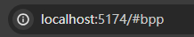
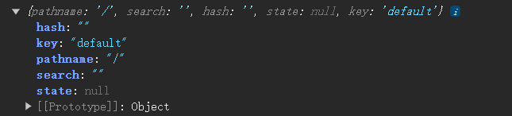
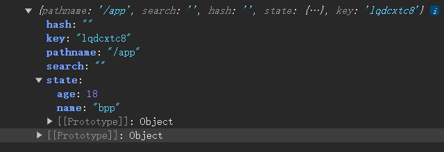
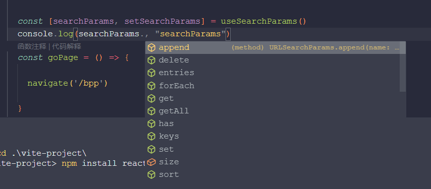
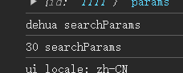
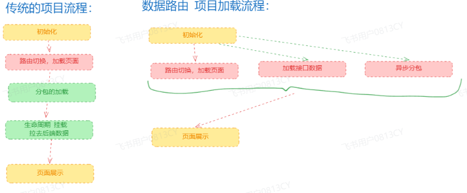
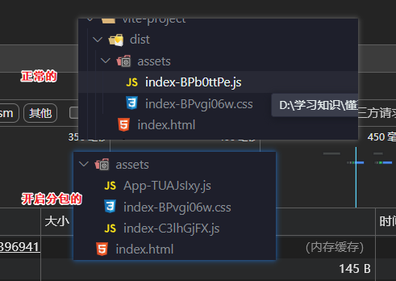
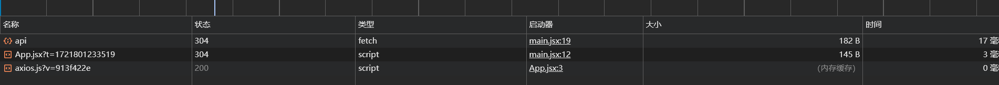

# 文档

文档

中文文档

[React 路由 | react router v6 中文文档](http://www.reactrouter.cn/)

英文文档

[Home v6.23.1 | React Router](https://reactrouter.com/en/main)

```sh
npm install react-router-dom
```

## 路由模式

::: tip 用法

```tsx
<BrowserRouter>
  {' '}
  //替换这个 就可以替换模式
  <Routes>
    <Route path="/app" element={<App />} />
    <Route path="/bpp" element={<Bpp />} />
  </Routes>
</BrowserRouter>
```

:::

### BrowserRouter

注意：后台进行需要一些配置，否则 404 找不到资源

nginx 配置

```tsx
server {
    listen 80;
    server_name your-domain.com;

    root /path/to/your/dist;  # 指向你的构建输出目录
    index index.html;

    location / {
        try_files $uri $uri/ /index.html;  # 尝试直接访问请求的文件或目录，如果不存在则回退到index.html
    }
}
```

```tsx
import React from 'react'
import ReactDOM from 'react-dom/client'
import App from './App.jsx'
import Bpp from './Bpp.jsx'
import './index.css'

import { BrowserRouter, Routes, Route } from 'react-router-dom' //引入组件，结构出路由
const root = ReactDOM.createRoot(document.getElementById('root'))
root.render(
  <BrowserRouter>
    <Routes>
      <Route path="/app" element={<App />} />
      <Route path="/bpp" element={<Bpp />} />
    </Routes>
  </BrowserRouter>
)
```

### HashRouter



路径有#

```tsx
import React from 'react'
import ReactDOM from 'react-dom/client'
import App from './App.jsx'
import Bpp from './Bpp.jsx'
import './index.css'

import { BrowserRouter, Routes, Route } from 'react-router-dom' //引入组件，结构出路由
const root = ReactDOM.createRoot(document.getElementById('root'))
root.render(
  <BrowserRouter>
    <Routes>
      <Route path="/app" element={<App />} />
      <Route path="/bpp" element={<Bpp />} />
    </Routes>
  </BrowserRouter>
)
```

### MemoryRouter

单元测试

```tsx
import * as React from 'react'
import { create } from 'react-test-renderer'
import { MemoryRouter, Routes, Route } from 'react-router-dom'

describe('My app', () => {
  it('renders correctly', () => {
    let renderer = create(
      <MemoryRouter initialEntries={['/users/mjackson']}>
        <Routes>
          <Route path="users" element={<Users />}>
            <Route path=":id" element={<UserProfile />} />
          </Route>
        </Routes>
      </MemoryRouter>
    )

    expect(renderer.toJSON()).toMatchSnapshot()
  })
})
```

### NativeRouter

手机使用的

```tsx
import * as React from 'react'
import { NativeRouter } from 'react-router-native'

function App() {
  return <NativeRouter>{/* The rest of your app goes here */}</NativeRouter>
}
```

### StaticRouter

静态路由，一般给 node 使用，服务端渲染使用，ssr

```tsx
import * as React from 'react'
import * as ReactDOMServer from 'react-dom/server'
import { StaticRouter } from 'react-router-dom/server'
import http from 'http'

function requestHandler(req, res) {
  let html = ReactDOMServer.renderToString(
    <StaticRouter location={req.url}>
      {/* The rest of your app goes here */}{' '}
    </StaticRouter>
  )

  res.write(html)
  res.end()
}

http.createServer(requestHandler).listen(3000)
```

## Outlet

子组件占位符

写一个例子

```tsx
//路由
import React from 'react'
import ReactDOM from 'react-dom/client'
import App from './App.jsx'
import Bpp from './Bpp.jsx'
import Layout from './layout.jsx'
import './index.css'

import { BrowserRouter, HashRouter, Routes, Route } from 'react-router-dom' //引入组件，结构出路由
const root = ReactDOM.createRoot(document.getElementById('root'))
root.render(
  <BrowserRouter>
    <Routes>
      <Route Route path="/" element={<Layout />}>
        <Route path="/app" element={<App />} />
      </Route>
      <Route path="/bpp" element={<Bpp />} />
    </Routes>
  </BrowserRouter>
)
```

布局

```tsx
import React from 'react'
import { Outlet } from 'react-router-dom'

export default function layout() {
  return (
    <div>
      <div>头部</div>
      {/* 内容 */}
      <div>
        {' '}
        <Outlet></Outlet>
      </div>
      <div>底部</div>
    </div>
  )
}
```

## useLocation

::: tip 用法

可以获取一些 navigate 路由过来的状态（对象）

:::

使用，打印看一下

```tsx
import React from 'react'
import { useLocation } from 'react-router-dom'

export default function App() {
  const location = useLocation()
  console.log(location)
  return <div>路由app</div>
}
```

原始的数据



## useNavigate 路由跳转

::: tip 用法

1. 可以进行路由跳转
2. 跳转的同时，还可以传递一些状态（state），useLocation 可以接收到
3. 返回 不传路径 传递 -1 就可以返回

:::

只进行路由跳转

```tsx
import React from 'react'
import { useLocation, useNavigate } from 'react-router-dom'

export default function Bpp() {
  const navigate = useNavigate()

  const location = useLocation()
  console.log(location)

  const goPage = (num) => {
    if (num === 1) {
      navigate('/bpp')
    } else {
      navigate('/app')
    }
  }
  return (
    <div>
      路由bpp
      <button
        onClick={() => {
          goPage(1)
        }}
      >
        跳转bpp
      </button>
      <button
        onClick={() => {
          goPage(2)
        }}
      >
        跳转app
      </button>
    </div>
  )
}
```

传递数据

- 通过第二个参数，传递对象即可

```tsx
import React from 'react'
import { useLocation, useNavigate } from 'react-router-dom'

export default function Bpp() {
  const navigate = useNavigate()

  const location = useLocation()
  console.log(location)

  const goPage = (num) => {
    if (num === 1) {
      navigate('/bpp')
    } else {
      navigate('/app', {
        //传递数据
        state: {
          name: 'bpp',
          age: 18,
        },
      })
    }
  }
  return (
    <div>
      路由bpp
      <button
        onClick={() => {
          goPage(1)
        }}
      >
        跳转bpp
      </button>
      <button
        onClick={() => {
          goPage(2)
        }}
      >
        跳转app
      </button>
    </div>
  )
}
```

useLocation 获取到的数据



## 动态路由 useParams

::: tip 用法

Route 声明的时候，在 path 属性上，进行占位就好了

:::

实现一下，先占位符

```tsx
<BrowserRouter>
  <Routes>
    <Route path="/app/:id" element={<App />} />
    <Route path="/bpp/:schem" element={<Bpp />} />
  </Routes>
</BrowserRouter>
```

怎么获取到数据呢

### useParams 获取数据

```tsx
import React from 'react'
import { useLocation, useNavigate, useParams } from 'react-router-dom'

export default function App() {
  const navigate = useNavigate()

  const location = useLocation()
  console.log(location, 'location')

  const params = useParams()
  console.log(params, 'params')
  const goPage = () => {
    navigate('/bpp')
  }
  return (
    <div>
      路由app
      <button onClick={goPage}>跳转bpp</button>
    </div>
  )
}
```

- 访问的路径 ```http://localhost:5174/app/1111```
- 获取的数据 `{id: '1111'}`
- 路由的声明 path="/app/:id"

这就很明白了，得到的是一个对象，key 是占位符 value 路径

多个占位符，也是一样的效果，多个键值对

## useParams

::: tip 用法

第一个参数获取查询参数的 比如

第二个 设置查询参数

```http://localhost:5174/app/1111?name=dehua&age=30```

```jsx
import { useSearchParams } from 'react-router-dom'
let [searchParams, setSearchParams] = useSearchParams()
```

- 解释一下

  - searchParams 主要是获取查询参数的
    - `append(name, value)`: 添加一个新的查询参数，如果该参数已存在，则添加其值到现有值的列表。
    - `delete(name)`: 删除指定名称的查询参数。
    - `get(name)`: 获取指定名称的查询参数的第一个值。
    - `getAll(name)`: 获取指定名称的查询参数的所有值（返回一个数组）。
    - `has(name)`: 检查是否存在指定名称的查询参数。
    - `set(name, value)`: 设置指定名称的查询参数的值。如果参数已存在，则会覆盖其值。
  - setSearchParams 主要是用来更新查询参数的

:::

```tsx
import React from 'react'
import {
  useLocation,
  useNavigate,
  useParams,
  useSearchParams,
} from 'react-router-dom'

export default function App() {
  const navigate = useNavigate()

  const location = useLocation()
  console.log(location, 'location')

  const params = useParams()
  console.log(params, 'params')

  const [searchParams, setSearchParams] = useSearchParams()
  console.log(searchParams.get('name'), 'searchParams')
  console.log(searchParams.get('age'), 'searchParams')
  const goPage = () => {
    navigate('/bpp')
  }
  return (
    <div>
      路由app
      <button onClick={goPage}>跳转bpp</button>
    </div>
  )
}
```



看一下获取到的数据



我们设置一下查询参数

```tsx
import React from 'react'
import {
  useLocation,
  useNavigate,
  useParams,
  useSearchParams,
} from 'react-router-dom'

export default function App() {
  const navigate = useNavigate()

  const location = useLocation()
  console.log(location, 'location')

  const params = useParams()
  console.log(params, 'params')

  const [searchParams, setSearchParams] = useSearchParams()
  console.log(searchParams.get('name'), 'searchParams')
  console.log(searchParams.get('age'), 'searchParams')
  const goPage = () => {
    navigate('/bpp')
  }
  const setParmas = () => {
    #设置查询参数
    setSearchParams({ name: '张三', age: 18 })
  }
  return (
    <div>
      路由app
      <button onClick={goPage}>跳转bpp</button>
      <button onClick={setParmas}>设置查询参数</button>
    </div>
  )
}
```

## Link 标签 路由跳转

```tsx
 <Link to='/bpp'>跳转到bpp</Link>

 <Link to='/bpp?name=dehuaa'>跳转到bpp</Link>
```

## 更改路由 抽离出来

### 原本的样子

```tsx
import React from 'react'
import ReactDOM from 'react-dom/client'
import App from './App.jsx'
import Bpp from './Bpp.jsx'
import Layout from './layout.jsx'
import './index.css'
import { BrowserRouter, HashRouter, Routes, Route } from 'react-router-dom' //引入组件，结构出路由
const root = ReactDOM.createRoot(document.getElementById('root'))
root.render(
  <BrowserRouter>
    <Routes>
      <Route Route path="/" element={<Layout />}>
        <Route path="/app/:id" element={<App />} />
        <Route path="/bpp/:as" element={<Bpp />} />
      </Route>
    </Routes>
  </BrowserRouter>
)
```

### 1 抽离出来

::: tip 用法

我们这里使用的还是 BrowserRouter 模式

createBrowserRouter 创建路由

RouterProvider 注入路由

```tsx
<RouterProvider router={router}></RouterProvider>
```

:::

```tsx
import React from 'react'
import ReactDOM from 'react-dom/client'
import App from './App.jsx'
import Bpp from './Bpp.jsx'
import Layout from './layout.jsx'
import './index.css'
import { createBrowserRouter, RouterProvider } from 'react-router-dom' //引入组件，结构出路由
const root = ReactDOM.createRoot(document.getElementById('root'))

const router = createBrowserRouter([
  {
    path: '/',
    element: <Layout />,
    children: [
      {
        path: '/app/:id',
        element: <App />,
      },
      {
        path: '/bpp/:as',
        element: <Bpp />,
      },
    ],
  },
])
root.render(<RouterProvider router={router}></RouterProvider>)
```

### 2 抽离出来

::: tip 用法

我们这里使用的还是 BrowserRouter 模式

createBrowserRouter 包裹 createRoutesFromElements 创建路由

RouterProvider 注入路由

```tsx
<RouterProvider router={router}></RouterProvider>
```

:::

```tsx
import React from 'react'
import ReactDOM from 'react-dom/client'
import App from './App.jsx'
import Bpp from './Bpp.jsx'
import Layout from './layout.jsx'
import './index.css'
import {
  createBrowserRouter,
  RouterProvider,
  createRoutesFromElements,
  Route,
} from 'react-router-dom' //引入组件，结构出路由
const root = ReactDOM.createRoot(document.getElementById('root'))

const router = createBrowserRouter(
  createRoutesFromElements(
    <Route path="/" element={<Layout />}>
      <Route path="/app" element={<App />}></Route>
      <Route path="/bpp" element={<Bpp />}></Route>
    </Route>
  )
)

root.render(<RouterProvider router={router}></RouterProvider>)
```

## 数据路由

1. 原来是瀑布流的模式 是串行的
2. 相关成并行的模式



配一下代理

```tsx
// https://vitejs.dev/config/
export default defineConfig({
  plugins: [react()],
  server: {
    proxy: {
      '/api': {
        target: 'http://localhost:3000',
        changeOrigin: true,
        secure: false,
        rewrite: (path) => path.replace(/^\/api/, ''),
      },
    },
  },
})
```

请求使用

```tsx
useEffect(() => {
  axios.get('/api').then((res) => {
    console.log(res.data)
  })
})
```

### 原本的流程

1. 点击跳到组件
2. 组件获取数据
3. 渲染数据

```tsx
import React, { useEffect, useState } from 'react'
import { useNavigate } from 'react-router-dom'
import axios from 'axios'

export default function App() {
  const navigate = useNavigate()
  const [data, setData] = useState({})

  const goPage = () => {
    navigate('/bpp')
  }

  useEffect(() => {
    axios.get('/api').then((res) => {
      console.log(res.data.data)
      setData(res.data.data)
    })
  }, [])

  return (
    <div>
      路由app
      <div>数据：{data.name}</div>
      <div>数据：{data.age}</div>
      <button onClick={goPage}>跳转bpp</button>
    </div>
  )
}
```

### 现在的流程

1. 点击组件，直接获取数据
2. 渲染

更改路由

```tsx
import React from 'react'
import ReactDOM from 'react-dom/client'
import App from './App.jsx'
import Bpp from './Bpp.jsx'
import Layout from './layout.jsx'
import './index.css'
import { createBrowserRouter, RouterProvider, createRoutesFromElements, Route } from "react-router-dom"  //引入组件，结构出路由
const root = ReactDOM.createRoot(document.getElementById('root'));

const router = createBrowserRouter(createRoutesFromElements(
  <Route path="/" element={<Layout />}>
    <Route loader={
      async (prams) => {
        console.log(prams, "prams");
        const res = await fetch("/api")
        return res
      }
    } path="/app" element={<App />}></Route>
    <Route path="/bpp" element={<Bpp />}></Route>
  </Route>
));


root.render(
  <RouterProvider router={router} ></RouterProvider>
);
));
```

组件获取数据渲染数据

1. 使用 hook 获取数据 useLoaderData

```tsx
import React, { useEffect, useState } from 'react'
import { useNavigate, useLoaderData } from 'react-router-dom'
import axios from 'axios'

export default function App() {
  const navigate = useNavigate()
  const goPage = () => {
    navigate('/bpp')
  }

  const res = useLoaderData()
  console.log(res.data, 'res')
  return (
    <div>
      路由app
      <div>数据：{res.data.name}</div>
      <div>数据：{res.data.age}</div>
      <button onClick={goPage}>跳转bpp</button>
    </div>
  )
}
```

## useLoaderData 数据路由（加载接口数据优化）

获取正常的数据我们上面已经写了

接下来写怎么获取查询参数，也就是 ?xxx=xx&xx=xx

```tsx
const router = createBrowserRouter(
  createRoutesFromElements(
    <Route path="/" element={<Layout />}>
      <Route path="/app" element={<App />} />
      <Route path="/bpp" element={<Bpp />} />
      <Route
        loader={async (params) => {
          console.log('params', params)

          const url = params.request.url
          const url_data = new URL(url)
          const name = url_data.searchParams.get('name')
          console.log('name', name)

          const res = await axios.get('/user')
          return res
        }}
        path="/user/:id"
        element={<User />}
      />
    </Route>
  )
)
```

## useLoaderData 数据路由（异步分包优化）

```tsx
// 组件加载使用lazy
const App = React.lazy(() => import('./App.jsx')) // 路由懒加载  分包开启了
```



页面第一次，会先调用数据，在调用分包之后的 js



看一下怎么优化呢

```tsx
// 原本的样子  已经优化了接口数据
<Route
  loader={async (prams) => {
    console.log(prams, 'prams')
    const res = await fetch('/api')
    return res
  }}
  path="/app"
  element={<App />}
></Route>
```

```tsx
//  优化接口数据 和 分包js并行拉取
<Route
  loader={async (prams) => {
    console.log(prams, 'prams')
    const res = await fetch('/api')
    return res
  }}
  path="/app"
  lazy={async () => {
    const data = await import('./App.jsx')
    const App = await data.default
    return {
      element: <App />,
    }
  }}
></Route>
```

## 数据路由解决的核心问题

::: tip 传统路由模式

1. 初始化
2. 路由切换，加载页面
3. 分包的加载
4. 组件挂载拉取数据
5. 页面展示

每个消耗 2 秒，到数据展示出来，消耗了 5 秒才看到页面

:::

::: tip 数据路由模式

把 2，3，4 步骤 并行执行

也就是 路由切换，加载页面，分包，拉取数据合到一起了，大大缩短渲染

页面看到事件缩短到 3 秒

:::
