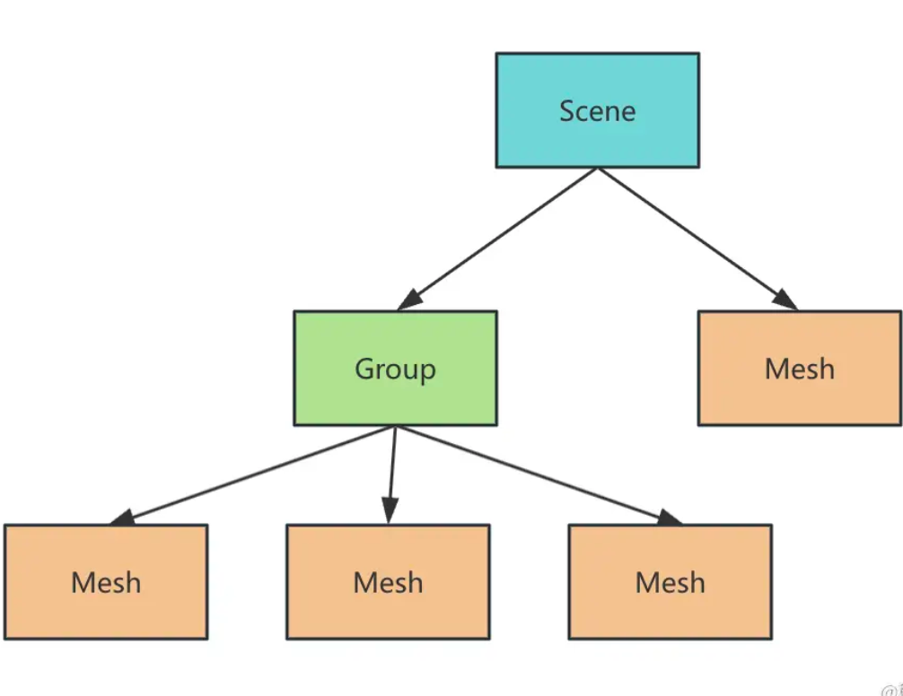
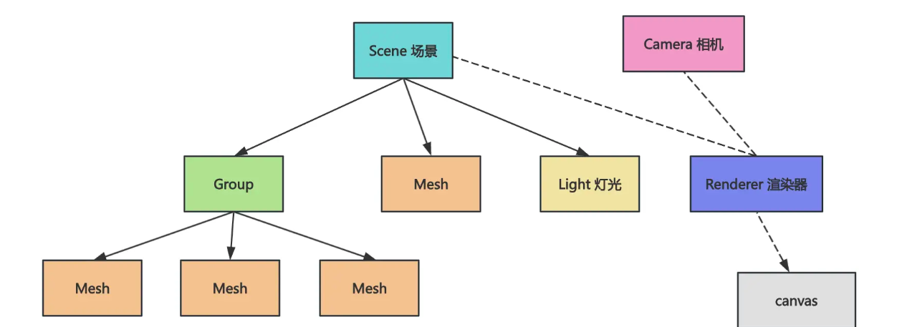
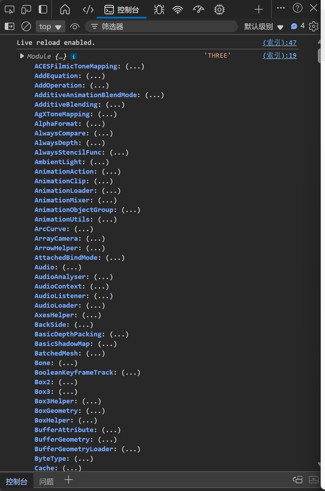
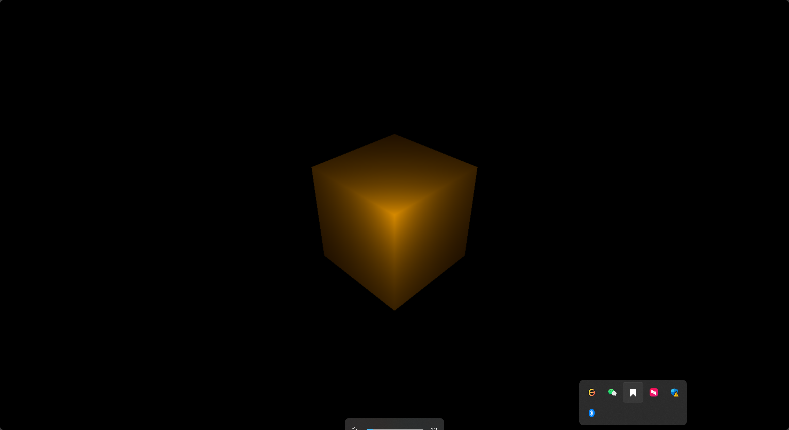

## 一 了解threejs

``threejs是用来创建和渲染三维世界的``

先了解几个概念

```
Mesh 物体
Geometry 几何体
Material  材质
Scene   场景
Camera 相机
Light 灯光
Renderer  渲染器
```

所有物体都有 Geometry 和 Material 这两部分

物体可以通过Group分组，最终构成一棵树，添加到场景 Scene 中。



从不同的角度观察，看到的画面不一样，所以有Camera的概念

3D世界是有光和阴影的，可以展示不同的明暗效果

最后有一个Renderer负责渲染，把场景 Scene、相机 Camera、灯光 Light 这些综合渲染到 canvas 画布上。



## 二 引入three

## 2.1引入方式1

```html
<!DOCTYPE html>
<html lang="en">
<head>
    <meta charset="UTF-8">
    <meta name="viewport" content="width=device-width, initial-scale=1.0">
    <title>Document</title>
    <style>
        body {
            margin: 0;
        }
    </style>
</head>
<body>
 <script type="module">
    import * as THREE from "https://esm.sh/three@0.174.0/build/three.module.js";

    console.log(THREE, "THREE");
  </script>
</body>
</html>

```

在 script标签 上加上 type="module" 就可以用 es module 的方式引入 three.js 包了。

```js
 <script type="module">
    import * as THREE from "https://esm.sh/three@0.174.0/build/three.module.js";

    console.log(THREE, "THREE");
  </script>
```



可以在控制台，看见打印的three对象，这就说明引入成功了

## 2.2引入方式二

```js
<!DOCTYPE html>
<html lang="en">
<head>
    <meta charset="UTF-8">
    <meta name="viewport" content="width=device-width, initial-scale=1.0">
    <title>Document</title>
    <style>
        body {
            margin: 0;
        }
    </style>
</head>
<body>
    <script type="importmap">
    {
        "imports": {
            "three": "https://esm.sh/three@0.174.0/build/three.module.js"
        }   
    }
    </script>
    <script type="module">
        import * as THREE from "three";

        console.log(THREE);
    </script>
</body>
</html>
```

用 type="importmap" 的 script 来声明 es module 的包名和 url 之间的映射

已经引入了，接下来下载一个three的类型包，写代码有提示

```shell
npm install --save-dev @types/three
```

[three.js docs](https://threejs.org/docs/) 文档地址

## 三 第一个场景



```js
import * as THREE from 'three';

const scene = new THREE.Scene();

{
  const geometry = new THREE.BoxGeometry(100, 100, 100);
  const material = new THREE.MeshLambertMaterial(({
    color: new THREE.Color('orange')
  }));
  const mesh = new THREE.Mesh(geometry, material);
  mesh.position.set(0, 0, 0);
  scene.add(mesh);
}

{
  const pointLight = new THREE.PointLight(0xffffff, 10000);
  pointLight.position.set(80, 80, 80);
  scene.add(pointLight);
}

{
  const width = window.innerWidth;
  const height = window.innerHeight;

  const camera = new THREE.PerspectiveCamera(60, width / height, 1, 1000);
  camera.position.set(200, 200, 200);
  camera.lookAt(0, 0, 0);

  const renderer = new THREE.WebGLRenderer();
  renderer.setSize(width, height)

  renderer.render(scene, camera);

  document.body.append(renderer.domElement);
}
```

欧克了，接下来一点一点分析一下这些代码

```html
import * as THREE from 'three';

// 第一步 创建scene 场景
const scene = new THREE.Scene();

{
  // 第二步 创建网格模型 立方体
  const geometry = new THREE.BoxGeometry(100, 100, 100);
  // 第三步 创建材质 
  const material = new THREE.MeshLambertMaterial(({
    color: new THREE.Color('orange')
  }));
  // 第四步   合成 物体
  const mesh = new THREE.Mesh(geometry, material);
  mesh.position.set(0, 0, 0);
  //  添加到场景中
  scene.add(mesh);
}

{
  // 第五步 创建灯光
  const pointLight = new THREE.PointLight(0xffffff, 10000);
  pointLight.position.set(80, 80, 80);
  // 添加到场景中
  scene.add(pointLight);
}

{
  // 第六步 获取宽高
  const width = window.innerWidth;
  const height = window.innerHeight;
  //  第七步 创建相机
  const camera = new THREE.PerspectiveCamera(60, width / height, 1, 1000);
  camera.position.set(200, 200, 200);
  camera.lookAt(0, 0, 0);
  //第八步 创建渲染器
  const renderer = new THREE.WebGLRenderer();
  // 设置渲染器大小
  renderer.setSize(width, height)
  //  第九步 渲染场景
  renderer.render(scene, camera);
  //  第十步 将渲染器添加到页面中
  document.body.append(renderer.domElement);
}
```


