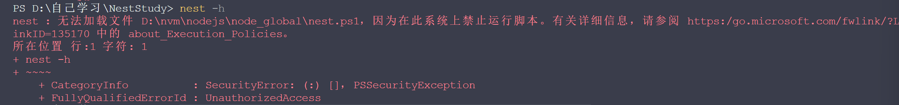
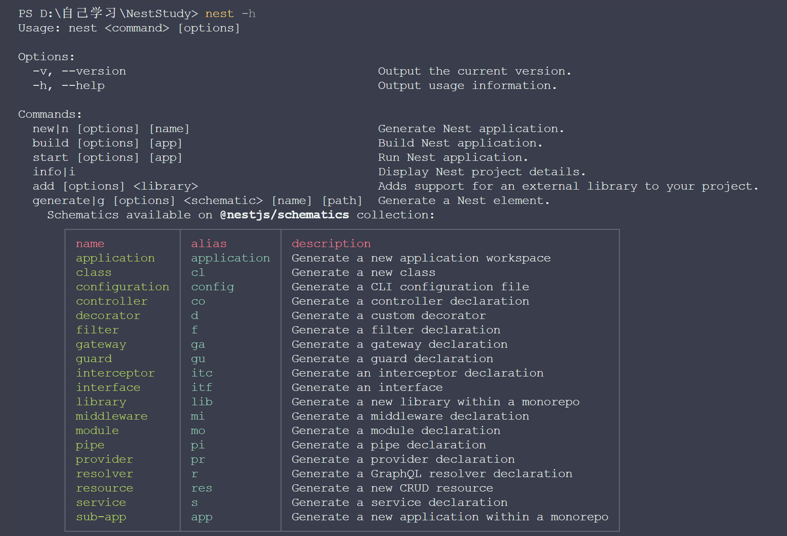
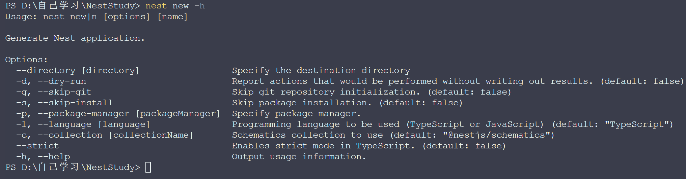
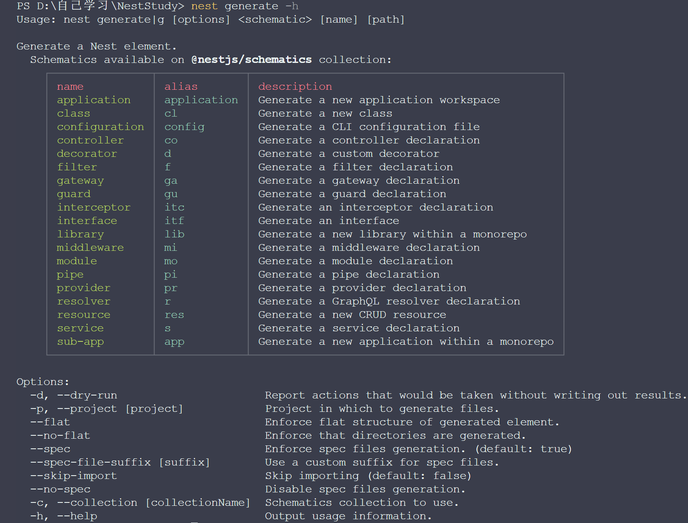
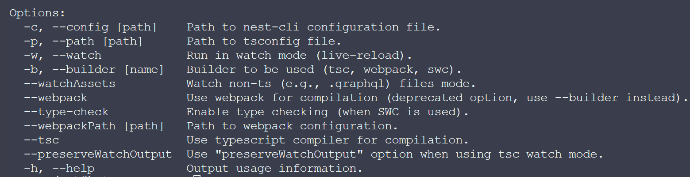

# 初识Nest

项目开发离不开工程化的部分，比如创建项目、编译构建、开发时 watch 文件变动自动构建等。Nest有专门的脚手架可以选择两种安装方式

```shell
方式一
npx @nestjs/cli new 项目名

方式二
npm install -g @nestjs/cli
nest new 项目名
```

其中方式二要注意: 过一段时间可以选择在次安装（如果你想用最新的话）

看一下nest脚手架都支持什么命令

```
nest -h
```

vscode 输入命令 可能会遇到下面的情况



这个报错，是权限不够

我试过了，我使用电脑自带的终端可以使用nest -h 命令

对vscode进行下面的命令

这是只对当前终端生效

```
Set-ExecutionPolicy -Scope Process -ExecutionPolicy RemoteSigned
```

下面这个是全局生效的

```
Set-ExecutionPolicy RemoteSigned
```

## Nest脚手架提供的命令

```
nest -h
```



## nest new 创建项目

```
nest [参数] new 项目名字
nest [参数] n   项目名字
```

##### 详细命令

```
nest new -h
```



参数是什么意思

- --skip-git        跳过    git 的初始化
-  --skip-install 跳过    npm install
- --package-manager 是指定包管理器
- --language 可以指定 typescript 和 javascript，一般我们都选择 ts，用默认的就好
- --strict 是指定 ts 的编译选项是否开启严格模式的

## nest generate  生成模板代码



记住几个常用的就可以了

```js
// 生成module 代码
nest generate module xxx
nest g mo xxx

//生成controller 代码
nest generate controller xxx
nest g co xxx

//生成service 代码
nest generate service xxx
nest g s xxx

//生成一个模块
nest generate resource xxx
nest ge res xxx
```

需要注意的是上面创建的会自动在 AppModule 引入

##### 详细命令

```
nest generate|g [options] <schematic> [name]
```

- --flat 和 --no-flat 是指定是否生成对应目录的
- --spec 和 --no-spec 是指定是否生成测试文件
- --skip-import 是指定不在 AppModule 里引入
- --project，这是指定生成代码在哪个子项目的，等之后用到 monorepo 项目的时候再说。

## nest build 打包

执行 nest build，会在 dist 目录下生成编译后的代码

```
nest bulid --help
```



--wepback 和 --tsc 是指定用什么编译，默认是 tsc 编译，也可以切换成 webpack。

tsc 不做打包、webpack 会做打包，两种方式都可以。

node 模块本来就不需要打包，但是打包成单模块能提升加载的性能。

 没学完等后续
