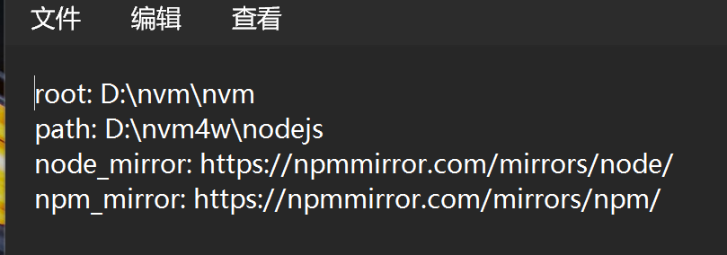

# nvm小工具

## 1.window安装nvm

[Releases · coreybutler/nvm-windows](https://github.com/coreybutler/nvm-windows/releases)   下载地址

安装


下载nvm-setup.exe

无脑安装就可以，我安装在D盘的nvm文件夹了

验证一下有没有安装成功

```shell
nvm v
```


```shell
nvm ls
```

查看已经安装的版本


我目前是什么也没有，很正常

```shell
nvm list available
```

查看可以安装的列表，我们选择第二列的LST版本，这个是长期支持版本


## 2.配置nvm

在 `nvm` 的安装路径下，找到 `settings.txt`，在后面加上这两行，设置国内淘宝镜像源：

```
node_mirror: https://npmmirror.com/mirrors/node/
npm_mirror: https://npmmirror.com/mirrors/npm/
```

以前的镜像是

https://npm.taobao.org/【该域名在 2022.06.30 号正式下线和停止 DNS 解析，新域名[npmmirror.com](https://developer.aliyun.com/mirror/NPM)】



配置完之后，我们下载的速度会快很多

## 3.命令使用

```shell
nvm list available  查看可安装的node版本
nvm install 16  下载node版本
nvm list     查看当前电脑安装的node和使用的node
nvm use xxx  使用某个版本
```


这里我安装了一个20版本的node,然后记得使用

```
nmv use 20
```

安装了node我们自然而然就有了npm

```shell
npm -v 
node -v 
```


修改npm的镜像源，不换很多包拉不下来，巨慢

```js
//修改镜像源地址
npm config set registry http://registry.npmmirror.com
//安装nrm
npm config get registry
```

## 4.配置 node 的 prefix（全局路径）和 cache（缓存路径

```
# npm config set cache "%NVM_SYMLINK%\node_cache"
npm config set cache "D:\nvm\nodejs\node_cache"
```

```
# npm config set prefix "%NVM_SYMLINK%\node_global"
npm config set prefix "D:\nvm\nodejs\node_global"
```

```
# 可编辑 .npmrc 配置文件
npm config edit
```

```
# 查看部分 .npmrc 配置信息
npm config ls
```

## 5.配置环境变量

因为我们设置了地址，但是node默认读的不是我们配置的这个缓存地址，会导致我们下的全局包，cmd里面读取不到，所以接下来要修改node的环境变量


这个值是这样创建的  然后就完事了 配置完成
