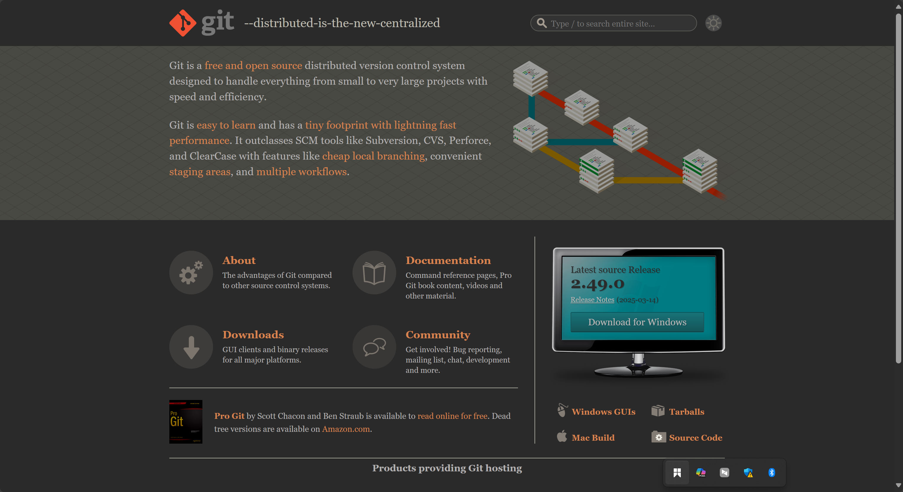
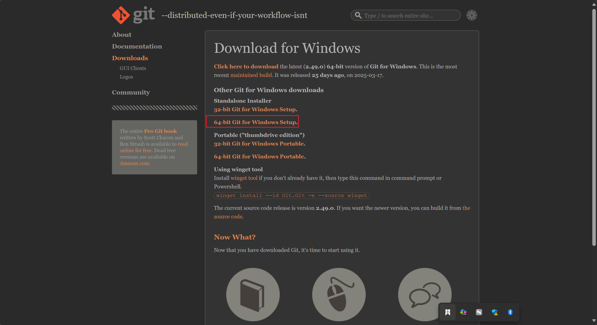

# git介绍

## 1.安装git

https://git-scm.com/





我就是傻瓜式安装，没啥技巧，不太懂，也懒得看，太多了

## 2.git配置

```
git config --global user.name 你的用户名  
git config --global user.email 你的邮箱地址  
```

这样就可以了

```
git config --list  
#如果信息太多，可以输入 q 退出  
```

